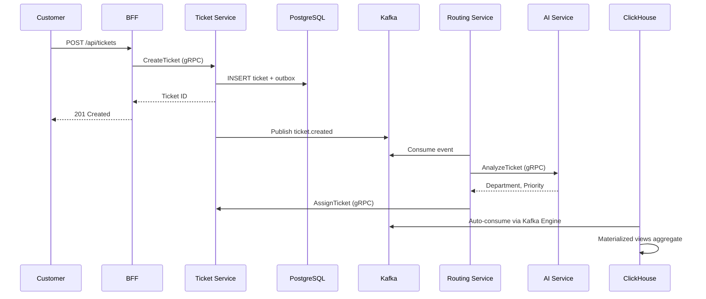
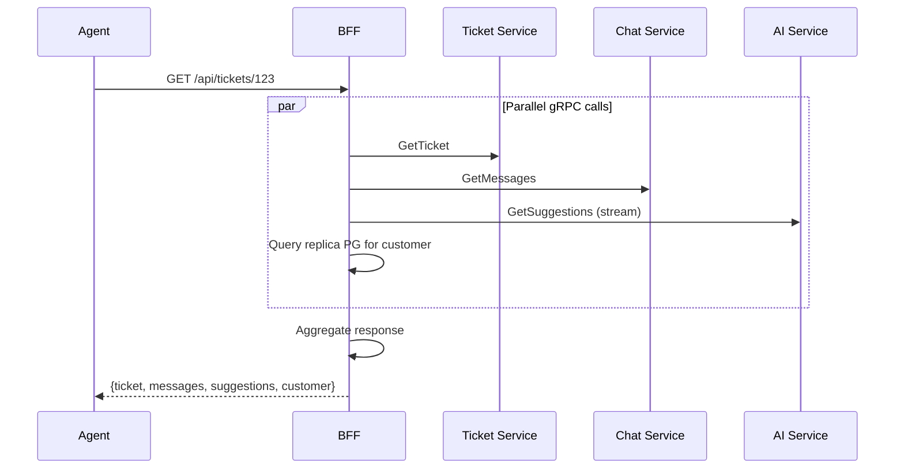

# TicketFlow: Architecture Documentation

## 📚 Documentation Overview

This repository contains the complete architecture documentation for **TicketFlow**, a multi-tenant helpdesk platform with AI-powered routing and analytics.

### Main Documents

| Document | Purpose | Status |
|----------|---------|--------|
| **[DESIGN_DOC.md](./DESIGN_DOC.md)** | Complete system design (architecture, data models, APIs, flows) | ✅ Draft |
| **ADR Directory** | Architecture Decision Records (key technical decisions) | ✅ Complete |

---

## 🏗️ System Overview

**TicketFlow** is a microservices-based helpdesk platform that handles customer support requests from multiple channels (web, email, Telegram, Slack) with:

- **AI-powered routing** (GPT-4/Claude for intelligent ticket assignment)
- **Real-time chat** (WebSocket for instant messaging)
- **SLA analytics** (ClickHouse for fast aggregations)
- **Omnichannel support** (unified inbox across all channels)

### Key Metrics
- **Scale**: 100 tenants, 500 concurrent agents, 10K tickets/day
- **Services**: 9 microservices (User, Ticket, Chat, Routing, SLA, AI, Integration, Analytics, BFF)
- **Technologies**: .NET 8, Next.js 14, gRPC, Kafka, RabbitMQ, PostgreSQL, ClickHouse, Redis

---

## 📋 Architecture Decision Records (ADRs)

### Core Decisions

| ADR | Decision | Rationale |
|-----|----------|-----------|
| **[ADR-001](./adr/ADR-001-microservices-architecture.md)** | Microservices Architecture | System Design interview preparation, service boundaries, independent scaling |
| **[ADR-002](./adr/ADR-002-grpc-for-services.md)** | gRPC for Inter-Service Communication | Type safety, performance (binary), streaming support |
| **[ADR-003](./adr/ADR-003-kafka-and-rabbitmq.md)** | Kafka for Events, RabbitMQ for Tasks | Kafka = durable event log; RabbitMQ = retry/DLQ for tasks |
| **[ADR-005](./adr/ADR-005-clickhouse-for-analytics.md)** | ClickHouse for Analytics (OLAP) | 100x faster aggregations, separate OLAP from OLTP workloads |
| **[ADR-006](./adr/ADR-006-nextjs-bff.md)** | Next.js as BFF | Single codebase (frontend + orchestration), SSR, built-in caching |
| **[ADR-007](./adr/ADR-007-outbox-pattern.md)** | Transactional Outbox Pattern | Guaranteed event delivery, solves dual-write problem |
| **[ADR-008](./adr/ADR-008-websocket.md)** | WebSocket for Real-Time | Low latency (<100ms), bidirectional, efficient |

### Quick Decision Matrix

| Use Case | Technology | Why |
|----------|------------|-----|
| **Service-to-service calls** | gRPC | Fast, type-safe, streaming |
| **Client-to-BFF** | REST/JSON | Browser-friendly, standard |
| **Events (audit, analytics)** | Kafka | Durable log, multiple consumers, replay |
| **Tasks (email, integrations)** | RabbitMQ | Retry, DLQ, simpler for jobs |
| **Real-time (chat, notifications)** | WebSocket | Low latency, bidirectional |
| **Transactional data (OLTP)** | PostgreSQL | ACID, relational, source of truth |
| **Analytics (OLAP)** | ClickHouse | Columnar, fast aggregations, materialized views |
| **Caching** | Redis | Fast, pub/sub for WebSocket scaling |

---

## 🎯 Key Architectural Patterns

### 1. CQRS (Command Query Responsibility Segregation)

**Commands (Write)** → PostgreSQL (OLTP)
- Create ticket, update status, send message

**Queries (Read)**:
- **Operational** → PostgreSQL replica (via BFF)
- **Analytical** → ClickHouse (via Analytics Service)

### 2. Event-Driven Architecture

```
Ticket Service → PostgreSQL (with Outbox)
    ↓
Outbox Publisher (background job)
    ↓
Kafka (ticket.events topic)
    ↓ (multiple consumers)
    ├─ Analytics Service → ClickHouse (SLA metrics)
    ├─ Routing Service → AI routing logic
    └─ SLA Service → Deadline monitoring
```

### 3. Backend for Frontend (BFF)

```
Browser
    ↓ HTTPS/WebSocket
Next.js BFF (API Routes + Server Components)
    ↓ gRPC (parallel calls)
    ├─ Ticket Service
    ├─ Chat Service
    ├─ AI Service (streaming)
    └─ User Service (from cache/replica)
```

Aggregates data from multiple services in one request.

### 4. Transactional Outbox

**Problem**: Writing to DB + publishing to Kafka is not atomic (dual-write).

**Solution**: Write to DB + outbox table in same transaction. Background job publishes to Kafka.

**Guarantee**: At-least-once delivery (events may duplicate, but never lost).

---

## 📊 Data Flow: OLTP vs OLAP

### OLTP (PostgreSQL)

**Used for:**
- Ticket CRUD operations
- Current state queries ("show me ticket #123")
- Real-time assignment
- Strong consistency required

### OLAP (ClickHouse)

**Used for:**
- SLA metrics (average response time, p95, p99)
- Historical trends (tickets per week)
- Performance reports (agent rankings)
- Eventual consistency acceptable (1 min lag)

### Flow: PostgreSQL → Kafka → ClickHouse

```
1. Ticket Service writes to PostgreSQL + outbox (atomic)
2. Outbox Publisher sends events to Kafka
3. ClickHouse Kafka Engine auto-consumes
4. Materialized Views transform events
5. Pre-aggregated tables store metrics
6. Analytics Service queries ClickHouse
```

**Why separate databases?**
- Analytical queries don't slow down ticket creation
- Columnar storage = 100x faster aggregations
- Can scale OLTP and OLAP independently

---

## 🔄 Key Sequence Flows

### Ticket Creation with AI Routing



### Agent Views Ticket (BFF Aggregation)



---

## 🚀 Technology Stack

### Backend Services (.NET 8)
- **Framework**: ASP.NET Core
- **Communication**: gRPC (service-to-service), WebSocket (real-time)
- **Databases**: PostgreSQL (per service), ClickHouse (analytics)
- **Messaging**: Kafka (events), RabbitMQ (tasks)
- **Caching**: Redis (cache, pub/sub, rate limiting)
- **Testing**: xUnit, Testcontainers, FluentAssertions

### Frontend (Next.js 14+)
- **Framework**: Next.js App Router
- **Rendering**: Server Components (SSR), Client Components (interactivity)
- **BFF**: API Routes (orchestration)
- **State**: React hooks, Context API
- **Styling**: Tailwind CSS

### Infrastructure
- **Containers**: Docker + Docker Compose
- **Service Discovery**: Docker DNS
- **Monitoring**: Structured logging (Serilog), correlation IDs

---

## 📈 Scalability Strategy

### Current (200 RPS avg, 1K RPS peak)

| Component | Strategy |
|-----------|----------|
| **Stateless services** | Horizontal scaling (just add instances) |
| **WebSocket** | Redis pub/sub (multi-server sharing) |
| **PostgreSQL** | Read replicas for BFF, connection pooling |
| **ClickHouse** | Single node sufficient (100K events/day) |
| **Kafka** | Over-provisioned (can handle 100K+ msg/sec) |

### Future (10x scale)

| Component | Upgrade |
|-----------|---------|
| **PostgreSQL** | Partition by tenant_id (sharding) |
| **ClickHouse** | Add replicas, sharding by tenant_id |
| **WebSocket** | More Redis instances, connection load balancing |
| **Services** | Auto-scaling (Kubernetes) |

---

## 🔐 Security Considerations

- **Authentication**: JWT (access: 15min, refresh: 7 days), HttpOnly cookies
- **Authorization**: Role-based (AGENT, TEAM_LEAD, ADMIN, CUSTOMER)
- **Multitenancy**: Row-level isolation (`tenant_id` in all queries)
- **Rate Limiting**: 100 req/min (agents), 20 req/min (customers)
- **Encryption**: HTTPS/WSS for all external traffic
- **Data Protection**: bcrypt for passwords (cost 12), GDPR compliance

---

## 📝 Development Roadmap

See the main methodology document for detailed roadmap with **Spec-Driven Development** approach and **AI agent usage rules**.

### Phase Overview (12-16 weeks)

| Phase | Services | Key Activities | AI Usage |
|-------|----------|----------------|----------|
| **Phase 0** | Infrastructure | Docker Compose, Design Doc, ADRs | Manual |
| **Phase 1** | User Service | First gRPC, first DB, first tests | **Manual** (create Skills) |
| **Phase 2** | Ticket Service | First Kafka integration, Outbox | Manual Kafka, Agent for CRUD |
| **Phase 3** | Chat Service | First WebSocket | Manual WebSocket, Agent for CRUD |
| **Phase 4** | Routing + AI | First LLM API, Circuit Breaker | Manual AI, Agent for routing logic |
| **Phase 5** | Analytics | First ClickHouse, Kafka Engine | **Manual** (create Skill) |
| **Phase 6** | SLA + Integration | Background jobs, external APIs | Agent (using Skills) |
| **Phase 7** | Next.js BFF | First API Route, first component | Manual first, Agent for rest |
| **Phase 8** | Channel Adapters | Telegram, Slack, Email | Manual first, Agent for rest |
| **Phase 9** | Polish | E2E tests, performance, docs | Agent-assisted |

**Rule**: First implementation of each technology = manual. Subsequent similar code = agent (using Skills).

---

## 🎓 Learning Objectives

This project is designed for **System Design interview preparation** at Big Tech companies. Upon completion, you should be able to:

### Architecture Skills
- ✅ Design microservices architecture with proper service boundaries
- ✅ Explain OLTP vs OLAP separation and when to use each
- ✅ Discuss trade-offs: consistency vs availability, latency vs throughput
- ✅ Defend architectural decisions under questioning

### Distributed Systems Patterns
- ✅ Implement Outbox Pattern (reliable event delivery)
- ✅ Implement CQRS (separate read/write models)
- ✅ Use Circuit Breaker (fault tolerance)
- ✅ Handle eventual consistency

### Technology Expertise
- ✅ gRPC for high-performance inter-service communication
- ✅ Kafka for event streaming and analytics pipeline
- ✅ ClickHouse for fast analytical queries
- ✅ WebSocket for real-time features
- ✅ Next.js for modern full-stack development

### System Design Interview
- ✅ Draw architecture diagrams in 5 minutes
- ✅ Explain what happens when each component fails
- ✅ Propose scaling strategies for 10x, 100x growth
- ✅ Calculate capacity estimates (storage, bandwidth, QPS)

---

## 📖 How to Use This Documentation

### For System Design Interview Prep
1. Read **DESIGN_DOC.md** to understand high-level architecture
2. Study each **ADR** to understand key decisions and trade-offs
3. Practice drawing architecture from memory
4. Explain to a friend: "Why Kafka vs RabbitMQ?" "Why ClickHouse vs PostgreSQL?"

### For Implementation
1. Start with **Phase 0** (infrastructure setup)
2. Follow roadmap in main methodology document
3. Read relevant ADR before implementing each component
4. Create Skills after first manual implementation

### For Interview Questions
- "Design a helpdesk system" → Use this architecture as starting point
- "How would you handle real-time chat?" → Reference ADR-008 (WebSocket)
- "How to scale analytics?" → Reference ADR-005 (ClickHouse)
- "Guarantee event delivery?" → Reference ADR-007 (Outbox Pattern)

---

## 🤝 Contributing

This is an educational project. Contributions welcome:
- Suggest improvements to architecture
- Point out missing considerations
- Add more ADRs for uncovered decisions
- Share interview experiences using this knowledge

---

## 📚 Additional Resources

**Books:**
- [Designing Data-Intensive Applications](https://dataintensive.net/) by Martin Kleppmann
- [Microservices Patterns](https://www.manning.com/books/microservices-patterns) by Chris Richardson
- [Building Microservices](https://www.oreilly.com/library/view/building-microservices-2nd/9781492034018/) by Sam Newman

**System Design Resources:**
- [System Design Primer](https://github.com/donnemartin/system-design-primer)
- [System Design Interview](https://www.youtube.com/c/SystemDesignInterview)
- [ByteByteGo](https://bytebytego.com/)

**Technology Docs:**
- [gRPC Documentation](https://grpc.io/docs/)
- [Apache Kafka](https://kafka.apache.org/documentation/)
- [ClickHouse Docs](https://clickhouse.com/docs/)
- [Next.js App Router](https://nextjs.org/docs/app)

---

**Project Status**: Architecture design complete ✅  
**Next Step**: Phase 0 - Infrastructure setup  
**Version**: 1.0  
**Last Updated**: February 12, 2026
