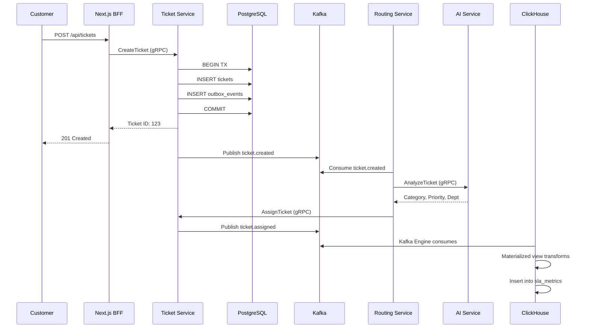
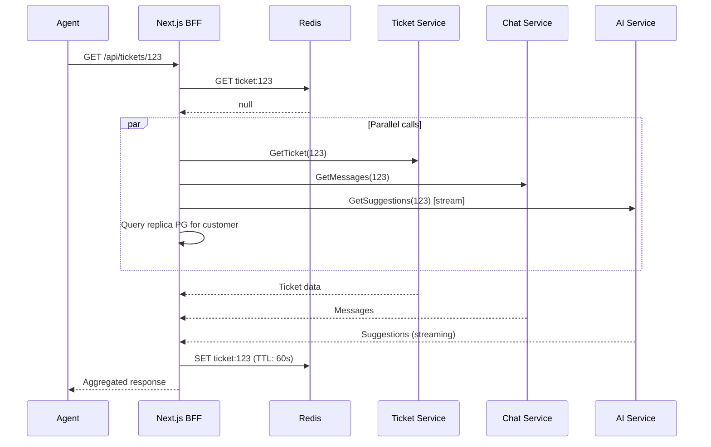

# Design Doc: TicketFlow Multi-Channel Helpdesk Platform

**Version:** 1.0  
**Date:** February 12, 2026  
**Author:** [Your Name]  
**Status:** Draft

---

## 1. Executive Summary

TicketFlow is a multi-tenant, microservices-based helpdesk platform with AI-powered routing and analytics. The system handles customer support requests from multiple channels (web, email, Telegram, Slack) in a unified interface.

**Key Architectural Decisions:**
- Microservices architecture (9 services)
- Separation of OLTP (PostgreSQL) and OLAP (ClickHouse)
- gRPC for inter-service communication
- Kafka for event streaming
- Next.js BFF for frontend orchestration
- AI integration via OpenAI/Claude API

**Scale Target:**
- 100 tenants, 500 concurrent agents
- 10,000 tickets/day, 50,000 messages/day
- 200 RPS average, 1,000 RPS peak

---

## 2. Goals and Non-Goals

### 2.1 Goals

- **System Design Practice**: Distributed system suitable for interviews at Big Tech companies
- **AI Integration**: Real-world LLM integration patterns (routing, RAG, suggestions)
- **OLAP Experience**: Learn when and how to separate analytical workloads
- **Full-stack**: Backend microservices + modern frontend (Next.js)

### 2.2 Non-Goals

- Voice/video calls
- Mobile native apps (responsive web only)
- Multi-language UI
- Built-in knowledge base editor
- SSO/SAML
- Kubernetes (Docker Compose for learning)

---

## 3. High-Level Architecture

```
┌─────────────────────────────────────────────────────────┐
│                   Client Layer                          │
│         Next.js App (Browser) - SSR + CSR              │
└──────────────────┬──────────────────────────────────────┘
                   │ HTTPS / WebSocket
┌──────────────────▼──────────────────────────────────────┐
│                Next.js BFF Layer                        │
│  • API Routes (orchestration)                           │
│  • Server Components (SSR)                              │
│  • Replica PostgreSQL (fast reads)                      │
│  • Redis (cache, push notifications)                    │
└──────────────────┬──────────────────────────────────────┘
                   │ gRPC / WebSocket
┌──────────────────▼──────────────────────────────────────┐
│               Microservices Layer                       │
│                                                         │
│  User Service  │  Ticket Service  │  Chat Service      │
│  Routing Svc   │  SLA Service     │  AI Service        │
│  Integration   │  Analytics Svc   │                     │
└──────────────────┬──────────────────────────────────────┘
                   │
┌──────────────────▼──────────────────────────────────────┐
│            Infrastructure Layer                         │
│                                                         │
│  Kafka  │  RabbitMQ  │  Redis                          │
│  ClickHouse (OLAP)  │  PostgreSQL (OLTP per service)   │
└─────────────────────────────────────────────────────────┘
```

### 3.1 Service Responsibilities

| Service | Purpose | Database |
|---------|---------|----------|
| **User Service** | Users, teams, tenants, auth | PostgreSQL |
| **Ticket Service** | Ticket CRUD, status management | PostgreSQL |
| **Chat Service** | Real-time messaging, WebSocket | PostgreSQL |
| **Routing Service** | Rules, AI-powered assignment | PostgreSQL |
| **SLA Service** | Deadline monitoring, escalations | PostgreSQL |
| **AI Service** | LLM API, RAG, suggestions | - |
| **Integration Service** | Jira/Trello, external channels | PostgreSQL |
| **Analytics Service** | Reports, SLA metrics | ClickHouse |
| **Next.js BFF** | Orchestration, SSR | Replica PG, Redis |

---

## 4. Data Architecture: OLTP vs OLAP

### 4.1 Why Separate Databases?

**PostgreSQL (OLTP)** - Source of truth:
- Tickets, messages, users, teams
- Current state queries (ticket status, assigned agent)
- Transactional operations (create, update, delete)
- Strong consistency required

**ClickHouse (OLAP)** - Analytics:
- SLA metrics (avg response time, p95, p99)
- Historical trends, performance reports
- Time-series aggregations
- Eventual consistency acceptable (up to 1 min lag)

### 4.2 Data Flow: PostgreSQL → Kafka → ClickHouse

```
Ticket Service
    ↓
PostgreSQL (INSERT ticket + outbox event)
    ↓
Outbox Publisher (background job)
    ↓
Kafka (ticket.events topic)
    ↓
ClickHouse Kafka Engine (auto-consume)
    ↓
Materialized View (transform JSON)
    ↓
Analytics Tables (pre-aggregated metrics)
```

**Key Pattern: Outbox for Reliability**

```csharp
// Atomic write to DB + outbox
await using var tx = await _db.Database.BeginTransactionAsync();
_db.Tickets.Add(ticket);
_db.OutboxEvents.Add(new OutboxEvent {
    EventType = "ticket.created",
    Payload = JsonSerializer.Serialize(ticket)
});
await _db.SaveChangesAsync();
await tx.CommitAsync();

// Background job publishes to Kafka
// Guarantees at-least-once delivery
```

---

## 5. Detailed Design

### 5.1 Core Data Models

#### Ticket Service Schema

```sql
CREATE TABLE tickets (
    id UUID PRIMARY KEY,
    tenant_id UUID NOT NULL,
    ticket_number VARCHAR(50) UNIQUE NOT NULL, -- ACME-1234
    
    -- Customer
    customer_email VARCHAR(255) NOT NULL,
    customer_id UUID REFERENCES users(id),
    
    -- Content
    subject VARCHAR(500) NOT NULL,
    description TEXT,
    channel VARCHAR(50) NOT NULL, -- WEB, EMAIL, TELEGRAM
    
    -- Status
    status VARCHAR(50) DEFAULT 'OPEN',
    priority VARCHAR(50) DEFAULT 'MEDIUM',
    
    -- Assignment
    assigned_to UUID REFERENCES users(id),
    department_id UUID,
    
    -- SLA
    sla_deadline TIMESTAMPTZ,
    first_response_at TIMESTAMPTZ,
    resolved_at TIMESTAMPTZ,
    
    -- Metadata
    tags TEXT[],
    sentiment VARCHAR(20),
    
    created_at TIMESTAMPTZ DEFAULT NOW(),
    updated_at TIMESTAMPTZ DEFAULT NOW()
);

CREATE INDEX idx_tickets_tenant ON tickets(tenant_id);
CREATE INDEX idx_tickets_status ON tickets(tenant_id, status);
CREATE INDEX idx_tickets_sla ON tickets(tenant_id, sla_deadline) 
  WHERE status IN ('OPEN', 'IN_PROGRESS');

-- Outbox for reliable Kafka publishing
CREATE TABLE outbox_events (
    id UUID PRIMARY KEY,
    aggregate_type VARCHAR(100) NOT NULL,
    aggregate_id UUID NOT NULL,
    event_type VARCHAR(100) NOT NULL,
    payload JSONB NOT NULL,
    created_at TIMESTAMPTZ DEFAULT NOW(),
    processed_at TIMESTAMPTZ
);
```

### 5.2 ClickHouse Schema

#### Raw Events Table

```sql
-- Kafka Engine (auto-consumes from Kafka)
CREATE TABLE ticket_events_queue (
    event_json String
) ENGINE = Kafka()
SETTINGS 
    kafka_broker_list = 'kafka:9092',
    kafka_topic_list = 'ticket.events',
    kafka_group_name = 'clickhouse_analytics',
    kafka_format = 'JSONAsString';

-- Target table for events
CREATE TABLE ticket_events (
    tenant_id String,
    ticket_id String,
    event_type String,
    event_time DateTime64(3),
    agent_id String,
    department_id String,
    priority Enum8('low'=1, 'medium'=2, 'high'=3, 'urgent'=4),
    status Enum8('open'=1, 'in_progress'=2, 'pending'=3, 'resolved'=4, 'closed'=5),
    event_id String  -- for deduplication
) ENGINE = ReplacingMergeTree(event_time)
PARTITION BY toYYYYMM(event_time)
ORDER BY (tenant_id, ticket_id, event_type, event_time);

-- Materialized View transforms JSON
CREATE MATERIALIZED VIEW ticket_events_mv TO ticket_events AS
SELECT
    JSONExtractString(event_json, 'tenant_id') as tenant_id,
    JSONExtractString(event_json, 'ticket_id') as ticket_id,
    JSONExtractString(event_json, 'type') as event_type,
    parseDateTimeBestEffort(JSONExtractString(event_json, 'timestamp')) as event_time,
    JSONExtractString(event_json, 'agent_id') as agent_id,
    JSONExtractString(event_json, 'department_id') as department_id,
    JSONExtractString(event_json, 'priority') as priority,
    JSONExtractString(event_json, 'status') as status,
    JSONExtractString(event_json, 'event_id') as event_id
FROM ticket_events_queue;
```

#### Pre-Aggregated Metrics

```sql
-- Hourly SLA metrics
CREATE TABLE sla_metrics_hourly (
    tenant_id String,
    department_id String,
    date Date,
    hour UInt8,
    priority Enum8('low'=1, 'medium'=2, 'high'=3, 'urgent'=4),
    
    tickets_created UInt64,
    tickets_resolved UInt64,
    sla_breached UInt64,
    first_responses UInt64,
    
    total_first_response_time UInt64,  -- seconds
    total_resolution_time UInt64,
    
    first_response_times Array(UInt32),  -- for percentiles
    resolution_times Array(UInt32)
) ENGINE = SummingMergeTree()
PARTITION BY toYYYYMM(date)
ORDER BY (tenant_id, department_id, date, hour, priority);

-- Materialized View aggregates events
CREATE MATERIALIZED VIEW sla_metrics_hourly_mv TO sla_metrics_hourly AS
SELECT
    tenant_id,
    department_id,
    toDate(event_time) as date,
    toHour(event_time) as hour,
    priority,
    
    countIf(event_type = 'ticket.created') as tickets_created,
    countIf(event_type = 'ticket.resolved') as tickets_resolved,
    countIf(event_type = 'sla.breached') as sla_breached,
    countIf(event_type = 'ticket.first_response') as first_responses,
    
    -- Aggregated times
    sumIf(
        dateDiff('second', 
            any(event_time) FILTER (WHERE event_type = 'ticket.created'),
            event_time
        ),
        event_type = 'ticket.first_response'
    ) as total_first_response_time,
    
    -- Array for percentile calculation
    groupArrayIf(
        dateDiff('second', 
            any(event_time) FILTER (WHERE event_type = 'ticket.created'),
            event_time
        ),
        event_type = 'ticket.first_response'
    ) as first_response_times
FROM ticket_events
WHERE event_type IN ('ticket.created', 'ticket.first_response', 'ticket.resolved', 'sla.breached')
GROUP BY tenant_id, department_id, date, hour, priority, ticket_id;
```

#### Example Analytics Query

```csharp
// Analytics Service - C# code
public async Task<SlaMetrics> GetSlaMetricsAsync(
    string tenantId, 
    DateOnly startDate, 
    DateOnly endDate)
{
    var query = @"
        SELECT
            department_id,
            sum(tickets_created) as total_tickets,
            sum(tickets_resolved) as resolved_tickets,
            sum(sla_breached) as breached,
            
            -- Average first response time
            sum(total_first_response_time) / sum(first_responses) as avg_first_response_seconds,
            
            -- Percentiles
            quantile(0.50)(arrayJoin(first_response_times)) as p50_first_response,
            quantile(0.95)(arrayJoin(first_response_times)) as p95_first_response,
            quantile(0.99)(arrayJoin(first_response_times)) as p99_first_response
        FROM sla_metrics_hourly
        WHERE tenant_id = {tenantId:String}
          AND date BETWEEN {startDate:Date} AND {endDate:Date}
        GROUP BY department_id";
    
    await using var connection = new ClickHouseConnection(_connectionString);
    await connection.OpenAsync();
    
    var command = connection.CreateCommand();
    command.CommandText = query;
    command.Parameters.AddWithValue("tenantId", tenantId);
    command.Parameters.AddWithValue("startDate", startDate);
    command.Parameters.AddWithValue("endDate", endDate);
    
    await using var reader = await command.ExecuteReaderAsync();
    
    var metrics = new List<DepartmentMetrics>();
    while (await reader.ReadAsync())
    {
        metrics.Add(new DepartmentMetrics
        {
            DepartmentId = reader.GetString(0),
            TotalTickets = reader.GetInt64(1),
            ResolvedTickets = reader.GetInt64(2),
            SlaBreached = reader.GetInt64(3),
            AvgFirstResponseSeconds = reader.GetInt64(4),
            P50FirstResponse = reader.GetInt32(5),
            P95FirstResponse = reader.GetInt32(6),
            P99FirstResponse = reader.GetInt32(7)
        });
    }
    
    return new SlaMetrics { Departments = metrics };
}
```

### 5.3 gRPC API Contracts

#### ticket.proto

```protobuf
syntax = "proto3";

package ticketflow.ticket.v1;

service TicketService {
  rpc CreateTicket(CreateTicketRequest) returns (Ticket);
  rpc GetTicket(GetTicketRequest) returns (Ticket);
  rpc UpdateTicket(UpdateTicketRequest) returns (Ticket);
  rpc ListTickets(ListTicketsRequest) returns (ListTicketsResponse);
  rpc AssignTicket(AssignTicketRequest) returns (Ticket);
  rpc UpdateStatus(UpdateStatusRequest) returns (Ticket);
}

message Ticket {
  string id = 1;
  string tenant_id = 2;
  string ticket_number = 3;
  string subject = 4;
  string description = 5;
  string channel = 6;
  string status = 7;
  string priority = 8;
  string customer_email = 9;
  string assigned_to = 10;
  string department_id = 11;
  int64 sla_deadline = 12;
  int64 created_at = 13;
}

message CreateTicketRequest {
  string tenant_id = 1;
  string subject = 2;
  string description = 3;
  string channel = 4;
  string customer_email = 5;
}
```

#### ai.proto

```protobuf
syntax = "proto3";

package ticketflow.ai.v1;

service AIService {
  rpc AnalyzeTicket(AnalyzeTicketRequest) returns (AnalyzeTicketResponse);
  rpc GenerateResponse(GenerateResponseRequest) returns (stream GenerateResponseChunk);
  rpc GetSuggestions(GetSuggestionsRequest) returns (stream SuggestionChunk);
}

message AnalyzeTicketRequest {
  string tenant_id = 1;
  string subject = 2;
  string description = 3;
}

message AnalyzeTicketResponse {
  string category = 1;
  string suggested_priority = 2;
  string sentiment = 3;
  repeated string suggested_tags = 4;
  string suggested_department_id = 5;
  float confidence = 6;
}

message GenerateResponseChunk {
  string content = 1;
  bool is_final = 2;
  repeated string sources = 3;  // KB article IDs
}
```

### 5.4 WebSocket Protocol

**Connection**
```
ws://localhost:3000/ws?token={jwt_token}
```

**Subscribe to channels**
```json
{
  "type": "subscribe",
  "channels": ["ticket.123", "inbox.user-456", "department.789"]
}
```

**Message types**
```json
// New message
{
  "type": "message.new",
  "ticket_id": "123",
  "message": {
    "id": "msg-456",
    "sender_id": "user-789",
    "content": "Hello",
    "created_at": 1634567890
  }
}

// Status changed
{
  "type": "ticket.status_changed",
  "ticket_id": "123",
  "old_status": "OPEN",
  "new_status": "IN_PROGRESS"
}

// Typing indicator
{
  "type": "typing",
  "ticket_id": "123",
  "user_id": "agent-456",
  "is_typing": true
}
```

---

## 6. Key Patterns

### 6.1 Backend for Frontend (BFF)

Next.js API Routes orchestrate multiple gRPC calls:

```typescript
// app/api/tickets/[id]/route.ts
export async function GET(req: Request, { params }: { params: { id: string } }) {
  const session = await getSession();
  
  // Parallel gRPC calls
  const [ticket, messages, suggestions, customer] = await Promise.all([
    ticketService.getTicket({ id: params.id }),
    chatService.getMessages({ ticketId: params.id }),
    aiService.getSuggestions({ ticketId: params.id }),  // streaming
    userService.getUser({ id: ticket.customerId })  // from replica/cache
  ]);
  
  return NextResponse.json({ ticket, messages, suggestions, customer });
}
```

**Benefits:**
- Single HTTP request from client
- Server-side composition (faster)
- Graceful degradation (if AI fails, still show ticket)

### 6.2 Outbox Pattern

Guarantees event delivery to Kafka:

```csharp
public async Task<Ticket> CreateTicketAsync(CreateTicketCommand cmd)
{
    await using var tx = await _context.Database.BeginTransactionAsync();
    
    var ticket = new Ticket { /* ... */ };
    _context.Tickets.Add(ticket);
    
    _context.OutboxEvents.Add(new OutboxEvent
    {
        EventType = "ticket.created",
        Payload = JsonSerializer.Serialize(ticket)
    });
    
    await _context.SaveChangesAsync();
    await tx.CommitAsync();
    
    return ticket;
}

// Background service publishes to Kafka
public class OutboxPublisher : BackgroundService
{
    protected override async Task ExecuteAsync(CancellationToken ct)
    {
        while (!ct.IsCancellationRequested)
        {
            var events = await _context.OutboxEvents
                .Where(e => e.ProcessedAt == null)
                .Take(100)
                .ToListAsync(ct);
            
            foreach (var evt in events)
            {
                await _kafka.ProduceAsync("ticket.events", evt.Payload);
                evt.ProcessedAt = DateTime.UtcNow;
            }
            
            await _context.SaveChangesAsync(ct);
            await Task.Delay(TimeSpan.FromSeconds(5), ct);
        }
    }
}
```

### 6.3 Circuit Breaker for AI API

Polly for resilience:

```csharp
var circuitBreaker = Policy
    .Handle<HttpRequestException>()
    .CircuitBreakerAsync(
        handledEventsAllowedBeforeBreaking: 3,
        durationOfBreak: TimeSpan.FromMinutes(1)
    );

var retry = Policy
    .Handle<HttpRequestException>()
    .WaitAndRetryAsync(3, attempt => TimeSpan.FromSeconds(Math.Pow(2, attempt)));

var policy = Policy.WrapAsync(circuitBreaker, retry);

try
{
    return await policy.ExecuteAsync(() => CallOpenAI(request));
}
catch (BrokenCircuitException)
{
    _logger.LogWarning("Circuit open for AI API");
    return FallbackResponse();  // Cached suggestions
}
```

---

## 7. Sequence Diagrams

### 7.1 Ticket Creation with AI Routing



### 7.2 Agent Views Ticket (BFF Aggregation)



---

## 8. Cross-Cutting Concerns

### 8.1 Multitenancy

**Row-level isolation:**
- Every table has `tenant_id` column
- EF Core Global Query Filter: `WHERE tenant_id = @current_tenant`
- gRPC interceptor extracts `tenant_id` from metadata
- ClickHouse queries MUST include `WHERE tenant_id = X`

```csharp
// EF Core
modelBuilder.Entity<Ticket>()
    .HasQueryFilter(t => t.TenantId == _tenantContext.TenantId);

// gRPC Interceptor
public class TenantInterceptor : Interceptor
{
    public override async Task<TResponse> UnaryServerHandler<TRequest, TResponse>(
        TRequest request, ServerCallContext context, 
        UnaryServerMethod<TRequest, TResponse> continuation)
    {
        var tenantId = context.RequestHeaders.GetValue("tenant-id");
        _tenantContext.TenantId = tenantId;
        return await continuation(request, context);
    }
}
```

### 8.2 Authentication

- JWT tokens (access: 15min, refresh: 7 days)
- HttpOnly cookies (XSS protection)
- Claims: `sub`, `tenant_id`, `role`, `email`

### 8.3 Observability

- Structured logs (JSON) with Serilog
- Correlation ID across services
- Fields: `correlation_id`, `tenant_id`, `user_id`, `service`

---

## 9. Technology Trade-offs

### Why gRPC?
**Pros:** Type-safe, fast (binary), bidirectional streaming  
**Cons:** Not human-readable, requires codegen  
**Alternative:** REST (easier debug, but slower)

### Why Kafka for events?
**Pros:** Durable log, replay, multiple consumers, high throughput  
**Cons:** Complex, resource-heavy  
**Alternative:** RabbitMQ (simpler, but no replay)  
**Decision:** Kafka for **events**, RabbitMQ for **tasks**

### Why ClickHouse?
**Pros:** Columnar (100x faster aggregations), materialized views, TTL  
**Cons:** Not general-purpose (no UPDATE), eventually consistent  
**Alternative:** PostgreSQL materialized views (one less DB, but slower)  
**Decision:** Separate OLAP for scalability

### Why Next.js BFF?
**Pros:** Single codebase (frontend + BFF), SSR, built-in caching  
**Cons:** Coupled to frontend  
**Alternative:** Separate ASP.NET Gateway (language consistency)  
**Decision:** Next.js for simplicity and SSR

---

## 10. Scalability

### Current Bottlenecks (at 1,000 RPS)

| Component | Risk | Mitigation |
|-----------|------|------------|
| PostgreSQL writes | Medium | Connection pooling, read replicas |
| WebSocket | Medium | Redis pub/sub for horizontal scaling |
| AI API | High | Circuit breaker, semantic cache |
| ClickHouse | Low | Async ingestion via Kafka |

### Horizontal Scaling

- **Stateless services**: Easy (just add instances)
- **WebSocket**: Redis pub/sub enables multi-server
- **PostgreSQL**: Read replicas for BFF
- **ClickHouse**: Single node → 100K events/day; replicas for read scaling

---

## 11. Security

- Passwords: bcrypt (cost 12)
- TLS/HTTPS for all external traffic
- Rate limiting: 100 req/min (agents), 20 req/min (customers)
- GDPR: Data export/deletion endpoints

---

## 12. Open Questions

1. LLM provider: OpenAI, Claude, or DeepSeek?
2. Knowledge base storage: PostgreSQL or vector DB (Pinecone)?
3. Email provider: SendGrid, AWS SES, or Mailgun?
4. File storage: Local, S3, or MinIO?

---

## 13. Success Criteria

**Technical:**
- [ ] >90% test coverage
- [ ] gRPC <100ms (p95)
- [ ] WebSocket <100ms delivery
- [ ] AI routing <3s
- [ ] ClickHouse queries <1s

**Learning:**
- [ ] Can explain any architectural decision
- [ ] Can draw system from memory
- [ ] Pass mock System Design interview
- [ ] Understand ClickHouse vs PostgreSQL trade-offs

---

## 14. References

- [Microservices Patterns](https://microservices.io/patterns/)
- [gRPC Best Practices](https://grpc.io/docs/guides/)
- [ClickHouse Docs](https://clickhouse.com/docs/)
- [Outbox Pattern](https://microservices.io/patterns/data/transactional-outbox.html)

---

**Status:** Draft → Ready for ADR review  
**Next:** Create ADRs, setup infrastructure (Phase 0)
